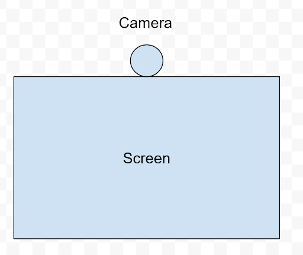
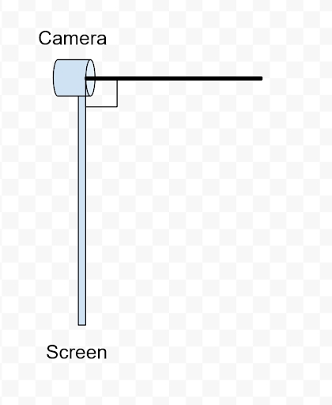

# Set Up Guide.
unless otherwise noted this guide needs to followed identically for each of the machines, i.e. the machine running `server.py` and the machine running `client.py`

### Step 1: Physical Set Up  
* Front view: Camera Should be centered at top of screen.

* Side view: Cameras view should be perpendicular to the screen.

### Step 2: Environment  
* Noise and distraction free.
* Well lit but not washed out.
* Each subject in different room
* Stable internet connection

### Step 3: Test Subject 
* Should not move around too much, some movement is fine but they should avoid large movements.
* Try to remain approximately 2 to 2.5 feet away from the screen.
* The subject eye level should be approximately at the center of screen.
* Head positioned in center of screen, i.e., not off to the left or right.
* Entire face needs to be visible to the subject on the other end.
* Seated at desk

### Step 4: Program Set Up
1) create python environment from included `environment.yaml` (this is most easily done with [ANACONDA](https://www.anaconda.com/))
2) FOR MACHINE RUNNING `client.py` ONLY
   * Find `ipv4` address of machine running `server.py` by running `ipconfig` in terminal
   * Create a text file called `server_ip.txt` and put it in the `\inputs` folder
   * The text file should only contain the `ipv4` address from the machine running `server.py` 
3) Create a file called `config.yaml` and put it in the `\inputs` folder
   * For data collection the `width` should be `1920` and the `height` should be `1080` 
   * For data collection `calibration` should be set to `calibration_quincunx`
   * In the `\inputs` folder an example called `config_example.yaml`
4) Download this [LogiTune](https://www.logitech.com/en-us/video-collaboration/software/logi-tune-software.html) this will be used to turn off auto focus. IMPORTANT: The software is finicky and will sometimes turn autofocus back on. Before starting each collection make sure it is still off. If autofocus is on the data collected will be unusable.
   * Download and open software
   * Select Brio 500
   * Select Image adjustments 
   * Turn off autofocus

### Step 5: Data Collection
* The discussion/prompt can realistically be anything that both parties agree. Here are some suggestions,
  1) Favorite movie or tv show and why
  2) Most recent vacation
* Data collection should last for 10 to 15 minutes or however long it can go without there being nothing left to talk about.
* During the calibration step both user need to follow the red dot on screen.

# How to Use and Expected Behavior
* Ensure that both machines are connected to the same network.
* Ensure that on both machines `Python` is allowed through the computers firewall .
* To start the system the user on the machine whose ip was obtained in step 4.2 must run `server.py` shortly after `client.py` must be run on the other machine.
* After being ran the following message should be printed to console `Estimating camera fps please wait` and the program will do "nothing" for 2 to 3 seconds.
* The calibration screen will appear and after a 3 second countdown a moving red dot will appear. (the calibration step can be aborted with `esc` but this will end the whole program)
* After both machines complete the calibration step the two computers will connect and it should function like any other video call app.
* To end the program press `e` the program may hang for 10 to 15 seconds, but it will resolve itself and exit gracefully.

